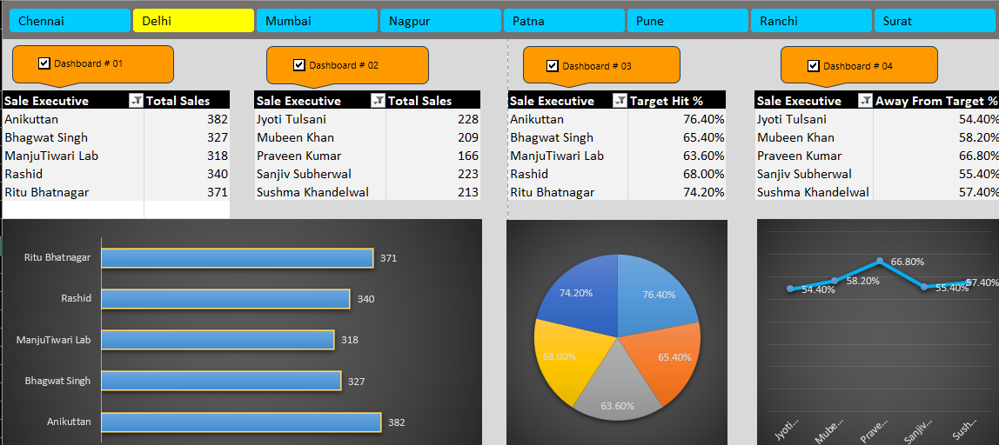

# Sales Dashboard with Dynamic Slicer Control

## Overview

An interactive Excel dashboard built using Pivot Tables, Pivot Charts, Slicers, and VBA. The project enables users to selectively connect dashboard components to a Region slicer using checkboxes, providing flexible and dynamic data analysis.

## Features

- Interactive Region Slicer
- Multiple Pivot Table dashboards
- Checkbox-controlled slicer connections
- Dynamic filtering using VBA
- Pivot Charts for data visualization
- Presentation-ready dashboard layout

## Dashboard Modules

### Dashboard #01
- Sales Executive Performance
- Total Sales Table
- Bar Chart Analysis

### Dashboard #02
- Sales Executive Performance
- Sales Comparison Dashboard

### Dashboard #03
- Target Achievement Analysis
- Pie Chart Visualization

### Dashboard #04
- Away From Target Analysis
- Trend Analysis using Line Chart

## Technologies Used

- Microsoft Excel
- Pivot Tables
- Pivot Charts
- Slicers
- VBA (Visual Basic for Applications)

## How It Works

Each dashboard has a dedicated checkbox linked to a worksheet cell.

| Checkbox | Pivot Table |
|-----------|-------------|
| Dashboard #01 | PivotTable1 |
| Dashboard #02 | PivotTable2 |
| Dashboard #03 | PivotTable3 |
| Dashboard #04 | PivotTable4 |

When a checkbox is selected:
- The corresponding PivotTable is connected to the Region slicer.
- Dashboard data updates according to slicer selections.

When a checkbox is deselected:
- The corresponding PivotTable is disconnected from the slicer.
- Dashboard remains unaffected by slicer changes.

## VBA Automation

The VBA module automatically:

- Detects checkbox states
- Connects PivotTables to the slicer cache
- Disconnects PivotTables from the slicer cache
- Updates dashboard interactivity in real time

## Use Cases

- Sales Performance Monitoring
- Regional Sales Analysis
- KPI Tracking
- Business Reporting
- Interactive Data Exploration

## Project Structure

Sales-Dashboard/
│
├── Sales_Dashboard.xlsm
├── README.md
└── Screenshots/
    └── dashboard.png

## Screenshot

## Author

**Muhammad Waleed**

Excel Dashboard Development • VBA Automation • Data Analytics
